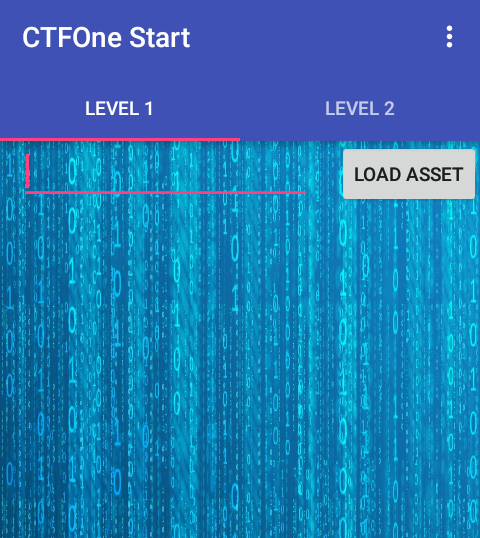

## Level 1

>Let's start you off with something easy to get you started.
>
>(Note: Levels 1-4 use the same application)</br>
>[ctfone-490954d49dd51911bc730d8161541cf13e7416f9.apk](./../challanges/ctfone-490954d49dd51911bc730d8161541cf13e7416f9.apk)

After installing and starting the application we are greeted with this screen




Clicking 'LOAD_ASSET' it loads up some random images and the button name tells most of things i.e its loading those images from the assets folder.

Lets verify it by using any decompiler i used [jadx](https://github.com/skylot/jadx).


Navigating to TabFragment1 in package com.h1702ctf.ctfone we see
```java
this.mButton = (Button) v.findViewById(R.id.lvl1button);
this.mButton.setOnClickListener(new OnClickListener() {
    public void onClick(View v) {
        String input = TabFragment1.this.mInput.getText().toString();
        if (input.isEmpty()) {
            input = "asset" + ((new Random().nextInt() % 10) + 1);
        }
        TabFragment1.this.loadDataFromAsset(input);
    }
});
```
So it loads assets and displays it if input field is not empty, lets extract asset folder.

I used [apkstudio](https://github.com/vaibhavpandeyvpz/apkstudio) to decompile the apk into smali, which also extracts assets and resources as we will need it for later challanges, you can also use apktool.

In the asset folder we see one interesting file <b>tHiS_iS_nOt_tHE_SeCrEt_lEveL_1_fiLE</b>


Flag - <b>cApwN{WELL_THAT_WAS_SUPER_EASY}</b>


#### Author
Arun Kumar Shreevastava