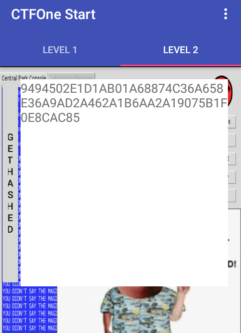

## Level 2

>Maybe something a little more difficult?
>
>(Note: Levels 1-4 use the same application)</br>
>[ctfone-490954d49dd51911bc730d8161541cf13e7416f9.apk](./../challanges/ctfone-490954d49dd51911bc730d8161541cf13e7416f9.apk)

After installing and starting the application and clicking the <i>GETTHEHASED</i> button we get this



Lets load it in a decompiler, i used [jadx](https://github.com/skylot/jadx).


Navigating to TabFragment2 in package com.h1702ctf.ctfone we see
```java
((Button) v.findViewById(R.id.hashmebutton)).setOnClickListener(new OnClickListener() {
    public void onClick(View v) {
        try {
            TabFragment2.this.mHashView.setText(InCryption.hashOfPlainText());
            TabFragment2.this.mHashView.setBackgroundColor(-1);
        } catch (Exception e) {
            e.printStackTrace();
        }
    }
    });
```
So main logic is in <i>InCryption.hashOfPlainText()</i>

```java
public static String hashOfPlainText() throws Exception
{
    return getHash(new String(hex2bytes(new String(decrypt(hex2bytes("0123456789ABCDEF0123456789ABCDEF"), hex2bytes(encryptedHex))).trim())));
}

private static byte[] decrypt(byte[] raw, byte[] encrypted) throws Exception
{
    SecretKeySpec skeySpec = new SecretKeySpec(raw, "AES");
    Cipher cipher = Cipher.getInstance("AES/ECB/PKCS5Padding");
    cipher.init(2, skeySpec);
    return cipher.doFinal(encrypted);
}
```

So it decrypts the encrypted flag with AES and return the hash of the flag, lets remove the getHash function to get the flag.

We can do it in two ways:

* Remove call to 'getHash' and return the plain text by editing the smali, recompiling it, installing it and then manually typing the decrypted flag.
* Copy the code to a java file, fix error, compile and get the flag.

I use first method when the class is big and there are lots of dependencies or there is lots of error in java file which prevents me from compiling.

But in this case its easy so lets use the second method, see the [Java Soln]() for solution.

Running we get:
<pre>
DASH DOT DASH DOT SPACE DOT DASH SPACE DOT DASH DASH DOT SPACE DOT DASH DASH SPACE DASH DOT SPACE DASH DOT DOT DOT SPACE DOT DASH DOT SPACE DOT DASH SPACE DASH DOT DASH DOT SPACE DASH DOT DASH SPACE DOT SPACE DASH SPACE DASH DOT DASH DOT SPACE DOT DASH DOT SPACE DASH DOT DASH DASH SPACE DOT DASH DASH DOT SPACE DASH DASH DOT DOT DOT SPACE DASH DASH DASH DASH DASH SPACE DASH DOT DOT DOT DOT SPACE DOT DASH DOT SPACE DOT DOT DOT DOT DASH SPACE DOT DASH DASH DOT SPACE DOT DOT DOT DOT SPACE DASH DOT DASH DASH SPACE DOT DOT DASH SPACE DASH DOT SPACE DASH DOT DOT SPACE DOT SPACE DOT DASH DOT SPACE DOT DOT DOT SPACE DASH DOT DASH DOT SPACE DASH DASH DASH SPACE DOT DASH DOT SPACE DOT SPACE DOT DASH DASH DASH DASH SPACE DOT DOT DOT DOT DOT SPACE DOT DOT DASH SPACE DASH DOT SPACE DASH DOT DOT SPACE DOT SPACE DOT DASH DOT SPACE DOT DOT DOT SPACE DASH DOT DASH DOT SPACE DASH DASH DASH SPACE DOT DASH DOT SPACE DOT SPACE DOT DOT DOT DOT SPACE DOT DOT DOT DOT DASH SPACE DOT DASH DOT SPACE DASH DOT DOT SPACE DOT DOT DASH SPACE DASH DOT SPACE DASH DOT DOT SPACE DOT SPACE DOT DASH DOT SPACE DOT DOT DOT SPACE DASH DOT DASH DOT SPACE DASH DASH DASH SPACE DOT DASH DOT SPACE DOT SPACE DASH DOT DOT DOT SPACE DOT DASH DOT SPACE DASH DASH DASH DASH DASH SPACE DASH DOT DOT DOT SPACE DOT DASH DOT SPACE DOT DASH SPACE DASH DOT DASH DOT SPACE DASH DOT DASH SPACE DOT SPACE DASH
</pre>

This is morse code but in different form, replacing those with their appropriate symbols we get

<pre>
-.-. .- .--. .-- -. -... .-. .- -.-. -.- . - -.-. .-. -.-- .--. --... ----- -.... .-. ....- .--. .... -.-- ..- -. -.. . .-. ... -.-. --- .-. . .---- ..... ..- -. -.. . .-. ... -.-. --- .-. . .... ....- .-. -.. ..- -. -.. . .-. ... -.-. --- .-. . -... .-. ----- -... .-. .- -.-. -.- . -
</pre>

Using [Online Morse Code Converter](http://www.onlineconversion.com/morse_code.htm) we get

<pre>
CAPWNBRACKETCRYP706R4PHYUNDERSCORE15UNDERSCOREH4RDUNDERSCOREBR0BRACKET
</pre>

Replacing 'BRACKET' with '{' and 'UNDERSCORE' with '_' we get the flag.

Flag - <b>CAPWN{CRYP706R4PHY_15_H4RD_BR0}</b>


Author
====
Arun Kumar Shreevastava