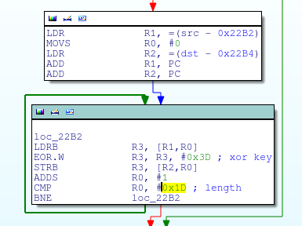

## Level 3

>Think you can solve level 3?
>
>(Note: Levels 1-4 use the same application)</br>
>[ctfone-490954d49dd51911bc730d8161541cf13e7416f9.apk](./../challanges/ctfone-490954d49dd51911bc730d8161541cf13e7416f9.apk)

There is no view for level 3, so we have to stick with code analsis only.

Lets load it in a decompiler, i used [jadx](https://github.com/skylot/jadx).

Fortunately we got Level3Activity in package com.h1702ctf.ctfone, so we can start our analysis from there.

Only thing that is interesting there is calling <i>MonteCarlo.start();</i> in a thread, moving on to that method we get
```java
public static void start() throws InterruptedException, ExecutionException
{
    long startTime = System.currentTimeMillis();
    ArrayList<Future<Double>> values = new ArrayList();
    ExecutorService exec = Executors.newFixedThreadPool(2);
    for (int i = 0; i < 2; i++) {
        values.add(exec.submit(new PiValue()));
    }
    ArraysArraysArrays.start();     <---
    Double sum = Double.valueOf(0.0d);
    Iterator it = values.iterator();
    while (it.hasNext()) {
        sum = Double.valueOf(sum.doubleValue() + ((Double) ((Future) it.next()).get()).doubleValue());
    }
    Log.i(TAG, "" + (sum.doubleValue() / ((double) 2)));
    Log.i(TAG, "" + ((System.currentTimeMillis() - startTime) / 1000));
}
```
All other things are just to distract only useful instruction is <i>ArraysArraysArrays.start();</i>

```java
public static void start()
{
    int[] list = new int[]{1, 2, 3, 4, 1, 2, 3};
    findAndPrintPairs(list, 5);
    bubblesort(list);
    showList(list);
    list = new int[]{1, 2, 3, 4, 5, 6, 7, 8, 9, 10, 11};
    bubblesort(list);
    showList(list);
    list = new int[]{11, 10, 9, 8, 7, 6, 5, 4, 3, 2, 1, 0, -1, -2};
    bubblesort(list);
    showList(list);
    x();            <---
    list = new int[]{1};
    bubblesort(list);
    showList(list);
}
```

Again other this are just distraction other than <b>x();</b> function which is defined as a native function. So we finally got to look inside the native library which is present in the lib folder of the apk.



<i>com/h1702ctf/ctfone/Requestor</i>

There are more such blocks but before blindly decrypting all of them lets first check what we have in 'Requester' class.

```java
public class Requestor {
    private static String sHostname = "h1702ctf.com";
    private static String sUrl = "https://h1702ctf.com/About";

    public static native String hName();

    public static native String hVal();

    public static void request() {
        try {
            new Builder().certificatePinner(new CertificatePinner.Builder().add(sHostname, "sha256/8yKUtMm6FtEse2v0yDMtT0hKagvpKSWHpnufb1JP5g8=").add(sHostname, "sha256/YLh1dUR9y6Kja30RrAn7JKnbQG/uEtLMkBgFF2Fuihg=").add(sHostname, "sha256/Vjs8r4z+80wjNcr1YKepWQboSIRi63WsWXhIMN+eWys=").build()).build().newCall(new Request.Builder().url(sUrl).addHeader(hName(), hVal()).build()).execute();
        } catch (IOException e) {
        }
    }
}
```

So we got only one method which calls home with some headers, but it adds certificate pinning to prevent us from seeing the request using burp or any other MITM proxy.

Now we can do two thing:

* Modify the smali of Requestor class and remove certificate pinning, recompile, sign and install and log the request made.
* Disassamble <i>hName</i> and <i>hVal</i> methods from native library and get the result.

While solving this challange i used the second method but while solving other challanges i came accross a very useful tool <b>[Frida](https://www.frida.re)</b> so i will show you how to do it easily with Frida. 

<b>Frida</b> is a multi-platform dynamic instrumentation framework to inject JavaScript into a process, have a  look at it once, it will make your life easier.

Getting back to challange, we have to call the methods hName and hVal from com/h1702ctf/ctfone/Requestor class.

Doing it in frida is piece of cake.
```javascript
Java.perform(function()
{
    var Requestor = Java.use("com.h1702ctf.ctfone.Requestor");
    console.log("hName() : " + Requestor.hName());
    console.log("hVal()  : " + Requestor.hVal());
});
```
Attaching it to our running application process and entering it in commandline, we get 
<pre>
hName() : X-Level3-Flag
hVal()  : V1RCR2QyUXdOVGROVmpnd1lsWTVkV1JYTVdsTk0wcG1UakpvZVUxNlRqbERaejA5Q2c9PQo=
</pre>

hVal is base64 encoded, actually three times. After decoding we get.

Flag - <b>cApwN{1_4m_numb3r_7hr33}</b>


Author
====
Arun Kumar Shreevastava