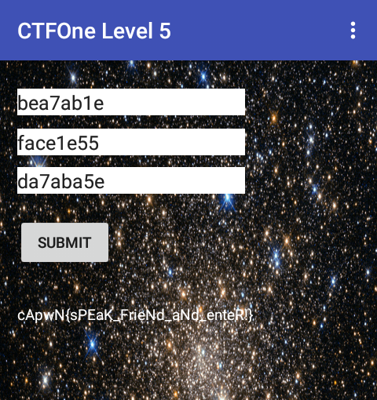

## Level 3

>Hmmm... looks like you need to get past something...
>
>(Note: Levels 1-4 use the same application)</br>
>[ctfone5-8d51e73cf81c0391575de7b40226f19645777322.apk](./../challanges/ctfone5-8d51e73cf81c0391575de7b40226f19645777322.apk)


This is a small apk with just two classes 'MainActivity' app's entrypoint and 'CruelIntentions' an IntentService.

MainActivity sets the flag with 
```java
((TextView) MainActivity.this.findViewById(R.id.flagOutput)).setText(MainActivity.this.flag(((TextView) MainActivity.this.findViewById(R.id.s0)).getText().toString(), ((TextView) MainActivity.this.findViewById(R.id.s1)).getText().toString(), ((TextView) MainActivity.this.findViewById(R.id.s2)).getText().toString()));
```
There are the three inputs that we see in the above screenshot.

<i>MainActivity.this.flag</i> is a native function which is defined as
```java
public native String flag(String str, String str2, String str3);
```

There is also one native function defined in 'CruelIntentions' named 'one' and it is invoked when we pass correct arguments to the Service. Lets switch to IDA and analyze it.

Well its a big function, took some time to break and here is short description of what it does:

* Open its own process and read the "TracerPid" which is non-zero if its ptraced ie debugged, kills itself it being debugged.
* Checks for presence of 'su' binary and if so then kills itself.
* It read a system property "mobsec.setme" and if not set then again kills itself.

Well we could bypass all by patching or setting appropriate values while debugging and then reach the point where it does something interesting in debugger but i asked myself what am i looking for in this method because this method doesn't seem to return anything.

So i follwed path in graph view where it will satisfy all the conditions and reached here.

Doing some math, in python because maths is hard :D we get this

<pre>
R0  = 0x5F53D58F + 0x5F53D58F
    = 0xbea7ab1e
R1  = 0x7D670F2A + 0x7D670F2B
    = 0xface1e55
R2  = 0x6D3D5D2F + 0x6D3D5D2F
    = 0xda7aba5e
</pre>

Entering this into the three fields we get



Flag - <b>cApwN{sPEaK_FrieNd_aNd_enteR!}</b>


Author
====
Arun Kumar Shreevastava