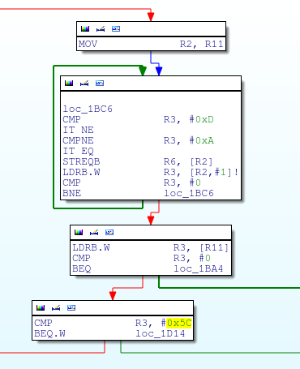
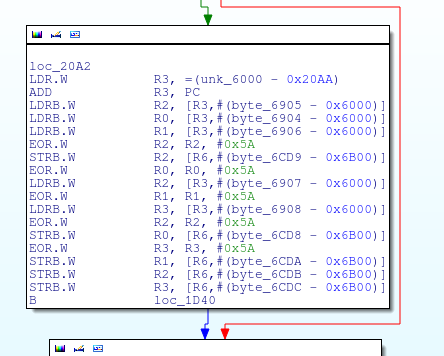
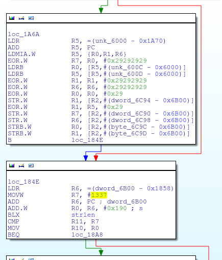
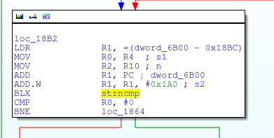
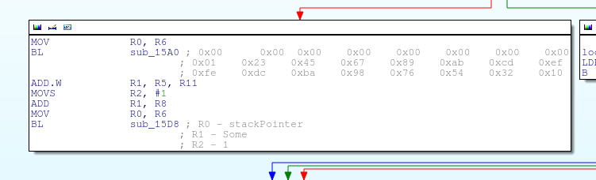
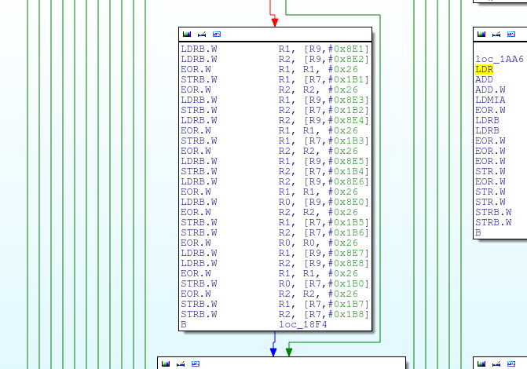
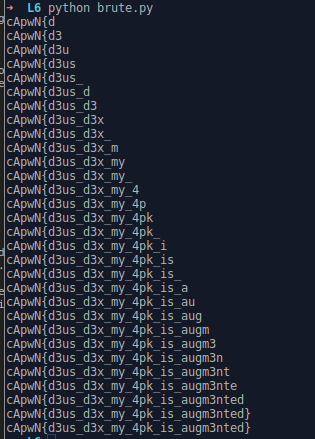

## Level 6

>I can't think of anything creative... just try to solve this one :)
>
>[ctfone6-6118c10be480b994654a1f01cd322af2df2ceab6.apk](./../challanges/ctfone6-6118c10be480b994654a1f01cd322af2df2ceab6.apk)

Well this apk has just one class 'MainActivity' but there's lots going on in there.

```java
dexWriter2.write(decrypt(getResources().getString(R.string.booper), getResources().getString(R.string.dooper), buf));

....
....

public static byte[] decrypt(String key, String initVector, byte[] encrypted) {
    try {
        IvParameterSpec iv = new IvParameterSpec(initVector.getBytes("UTF-8"));
        SecretKeySpec skeySpec = new SecretKeySpec(key.getBytes("UTF-8"), "AES");
        Cipher cipher = Cipher.getInstance("AES/CBC/PKCS5PADDING");
        cipher.init(2, skeySpec, iv);
        return cipher.doFinal(encrypted);
    } catch (Exception ex) {
        ex.printStackTrace();
        return null;
    }
}
```

It decrypts "something.jar" file from "res/raw" folder. Well we can bypass some checks done by the app by patching and then fixing other checks and it will decrypt the jar file for us but that again more work, as now we know key and IV we can use openssl or copy paste it to java and do it ourselves.

<pre>
Key = UCFh%divfMtY3pPD
Iv  = nY6FtpPFXnh,yjvc

openssl enc -d -aes-128-cbc -in something.jar -out something_dec.jar -K 5543466825646976664d745933705044 -iv 6e59364674705046586e682c796a7663
</pre>

Decrypted jar file contains a classes.dex file. Loading it in jadx we see that there is another AES decryption happening in "Pooper" class, a BroadCast receiver which verifies the key and IV using two different functions and then decrypts the 'secretasset' file from "res/raw" folder.

"checkSomething1" checks for Key

```java
public boolean checkSomething1(String a) {
    boolean didSomething = true;
    int i = 0;
    while (i < a.length()) {
        switch (a.charAt(i)) {
            case '1':
                if (i == 1) {
                    break;
                }
                didSomething = false;
                break;
            case '4':
                if (!(i == 6 || i == 10)) {
                    didSomething = false;
                    break;
                }
            case 'a':
                if (i == 2) {
                    break;
                }
                didSomething = false;
                break;
            case 'b':
                if (!(i == 0 || i == 4 || i == 8 || i == 12)) {
                    didSomething = false;
                    break;
                }
            case 'h':
                if (!(i == 3 || i == 7 || i == 11)) {
                    didSomething = false;
                    break;
                }
            case 'l':
                if (!(i == 5 || i == 9 || i == 13)) {
                    didSomething = false;
                    break;
                }
            case 'o':
                if (i == 14) {
                    break;
                }
                didSomething = false;
                break;
            case 'p':
                if (i == 15) {
                    break;
                }
                didSomething = false;
                break;
            default:
                didSomething = false;
                break;
        }
        i++;
    }
    return didSomething;
}
```

"checkSomething2" validates the IV

```java
public boolean checkSomething2(String a) {
    boolean didSomething = true;
    int i = 0;
    while (i < a.length()) {
        switch (a.charAt(i)) {
            case 'a':
                if (i == 9) {
                    break;
                }
                didSomething = false;
                break;
            case 'd':
                if (!(i == 8 || i == 14)) {
                    didSomething = false;
                    break;
                }
            case 'g':
                if (i == 11) {
                    break;
                }
                didSomething = false;
                break;
            case 'h':
                if (!(i == 2 || i == 5)) {
                    didSomething = false;
                    break;
                }
            case 'i':
                if (i == 6) {
                    break;
                }
                didSomething = false;
                break;
            case 'm':
                if (!(i == 0 || i == 1 || i == 3)) {
                    didSomething = false;
                    break;
                }
            case 'o':
                if (!(i == 12 || i == 13)) {
                    didSomething = false;
                    break;
                }
            case 's':
                if (!(i == 7 || i == 15)) {
                    didSomething = false;
                    break;
                }
            case 't':
                if (!(i == 10 || i == 4)) {
                    didSomething = false;
                    break;
                }
            default:
                didSomething = false;
                break;
        }
        i++;
    }
    return didSomething;
}
```

These two functions should return true which is only possible if all the checks are satisfied. By satisfying the checks we can inturn create the key and IV to decrypt "secretasset".

<pre>
KEY = b1ahbl4hbl4hblop
IV =  mmhmthisdatgoods

openssl enc -d -aes-128-cbc -in secretasset -out secretasset_dec -K 62316168626c3468626c3468626c6f70 -iv 6d6d686d74686973646174676f6f6473
</pre>

Running `file` command on the decrypted file we see that that its an ELF-32bit ARM binary.

Running it in via shell doesn't produce any output so again lets load it up in IDA.

Looking at the functions window we see network library calls like 'socket', 'bind', 'listen' which confirms that this application might be listening on some port.

Running `netstat` in adb shell we get that indeed it listen on port 1337.

Forwarding ports so that we can connect it with netcat from host system directly.

<pre>
$ adb forward tcp:1337 tcp:1337
$ nc 127.0.0.1 1337
<< JOIN, HELLO 10
</pre>

Even if we type anything in the console we don't get any output, we need to figure out the commands to interact with the server.



Here we see it read string until it finds '\\r\\n' and then compares first character in R3 to 0x5C which in ascii is '\\' so the first character must be '\\' for commands.

Entering '\\' we get <b><<UNKOWN COMMAND</b> so we are on right path.

All strings are encrypted with different xor key and its something like this



For commands atleast after decryption there is a "strcmp" so lets use [Frida](https://www.frida.re/) to hook strcmp and dump those arguments.

Using a simple JavaScript we hook strcmp
```javascript
Interceptor.attach(Module.findExportByName(null, "strcmp"), {
    onEnter: function (args) {
        console.log("[*] Strcmp " + Memory.readUtf8String(args[0]) + " , " + Memory.readUtf8String(args[1]));
    }
});
```

Output in Frida when i sent '\\'.
<pre>
[*] Strcmp \ , \QUIT
[*] Strcmp \ , \PING
[*] Strcmp \ , \NAME
[*] Strcmp \ , \PRIVATE
[*] Strcmp \ , \ACTIVE
[*] Strcmp \ , \HELP
</pre>

So we now have list of commands. Well it took me a day or two to understand what each command was doing and if there was any special feature that it was capable of. Turns out '\\PRIVATE' is one such. It has longest path in IDA graph.

Long story short, i found that '\\PRIVATE' need two arguments, first one REFERENCE and second one MESSAGE, to pass some checks and to land in another function with some more checks.

Entering the function we see it decrypts some characters.



I coded a helper function which decrypts it to 'gettin it done'. Also we see '1337' being compared to some register, turns out its the REFERENCE that we entered. So REFERENCE must be equal to '1337' noted.

Just below few instructions we see a strncmp with our MESSAGE string, so our string must begin with that prefix, noted.



Then there was constants being setup, i dumped the constants using GDB but thats all, couldn't figure out what to do next.



Then there was a big if-else kind of statement in the same function which was not referenced from anywhere(atleast that what IDA thinks, but putting breakpoints using GDB and sometime with Frida, i found that it was called for each of the characters in message)



Decrypting it with the little helper of my own, i get 

<pre>
key: 26
length: 10
offset: 8e0
>>Nice one!&&&))_Z
</pre>

So its message "Nice One!". Tracing in GDB from where it is called from, i found the calling method at 0xB74. Damn that method is very big, from 0xB74 to 0x159A, around 1300 ARM instructions. Understanding it was my last option.

Then i thought it might be printing "Nice one!" if i entered correct flag?, but then why loop for all characters in the entered MESSAGE, is it checking character by character, only way to verify it was to enter the "cApwN" prefix.

<pre>
$ nc 127.0.0.1 1337
<< JOIN, HELLO 11
\PRIVATE 1337 gettin it done cApwN
Nice one!Nice one!Nice one!Nice one!Nice one!
</pre>

Well that was pure luck with some crazy idea and it worked, we get 'Nice one!' for number of correct character.

Now we can brute force the flag character by character.

See [brute.py](brute.py) for the script.



It took less than a mins to bruteforce.

Flag - <b>cApwN{d3us_d3x_my_4pk_is_augm3nted}</b>

Author
====
Arun Kumar Shreevastava